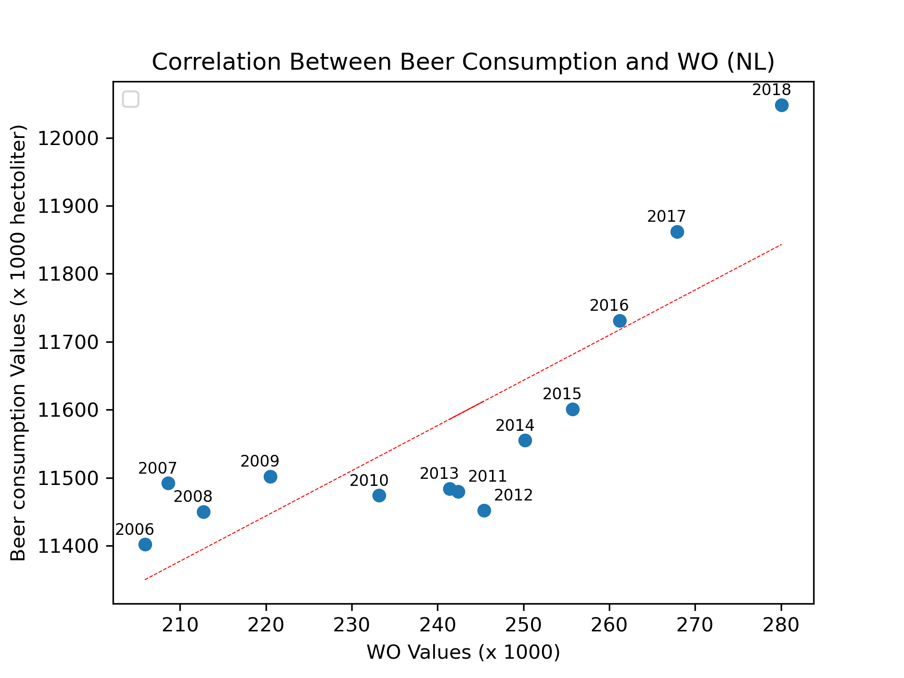

# Solution from Student ID: 16198921
 
## Title of papers

- Van Dyke, Marley C Caballero, Marcus M Teixeira, e Bridget M Barker. «Fantastic Yeasts and Where to Find Them: The Hidden Diversity of Dimorphic Fungal Pathogens». Current Opinion in Microbiology 52 (dicembre 2019): 55–63. https://doi.org/10.1016/j.mib.2019.05.002.
- Harvey, J.T, J Culvenor, W Payne, et al. «An Analysis of the Forces Required to Drag Sheep over Various Surfaces». Applied Ergonomics 33, fasc. 6 (2002): 523–31. https://doi.org/10.1016/S0003-6870(02)00071-6.
- Zeigler, Donald W., Claire C. Wang, Richard A. Yoast, et al. «The Neurocognitive Effects of Alcohol on Adolescents and College Students». Preventive Medicine 40, fasc. 1 (2005): 23–32. https://doi.org/10.1016/j.ypmed.2004.04.044.

## Plot: is there correlation between WO and beer consumption?

The plot shows the relationship between beer consumption and the number of WO students (university enrollments). It suggests a positive correlation: as the number of WO students increases, beer consumption also tends to increase. However, the relationship is not perfectly linear. Specifically, around 2010 and 2012 beer consumption decreased despite an increase in WO enrollments. In the later years, particularly from 2016 to 2018, both beer consumption and WO student numbers grow together.